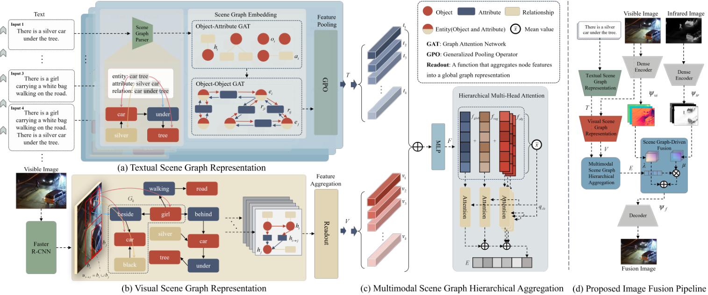
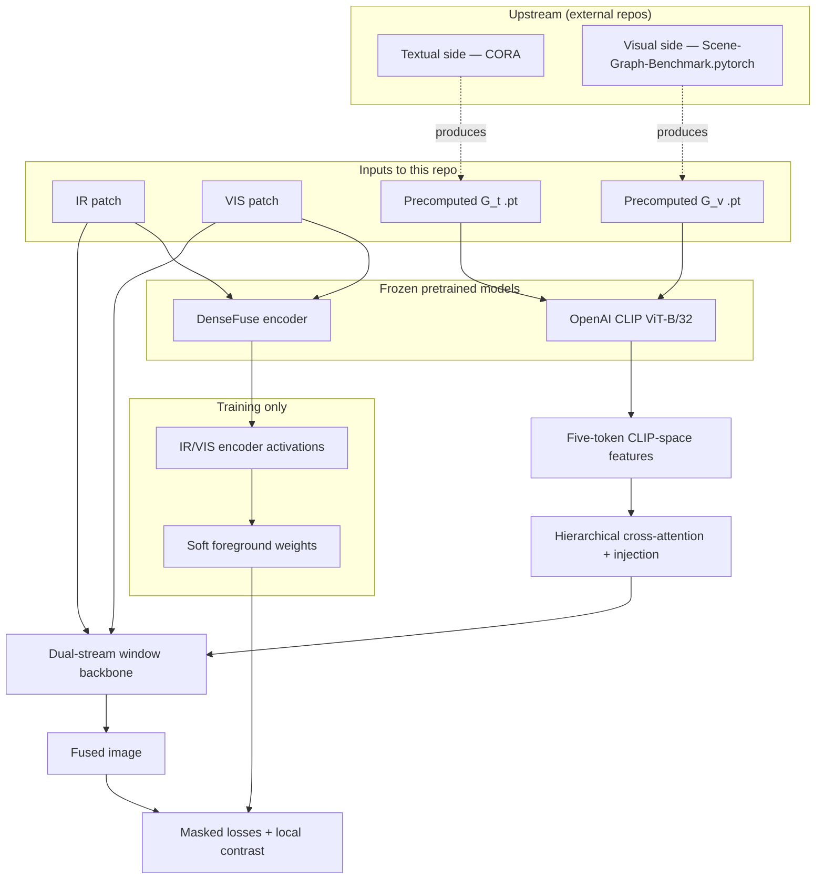

<div align="center">

<h1>MSGFusion</h1>
<h3>Multimodal Scene Graph–Guided Infrared and Visible Image Fusion</h3>

<p>
  <a href="mailto:guihuilee@ouc.edu.cn">Guihui Li</a><sup></sup> &nbsp;·&nbsp;
  <a href="mailto:dbw@ouc.edu.cn">Bowei Dong</a><sup></sup> &nbsp;·&nbsp;
  <a href="mailto:dongkaizhi@ouc.edu.cn">Kaizhi Dong</a><sup></sup> &nbsp;·&nbsp;
  <a href="mailto:jiayilee@ouc.edu.cn">Jiayi Li</a><sup></sup>&nbsp;·&nbsp;
  <a href="mailto:zhenghaiyong@ouc.edu.cn">Haiyong Zheng</a><sup></sup>
</p>


<p>
  <!-- After public release, uncomment and fill in:
  <a href="https://arxiv.org/abs/xxxx.xxxxx"></a>
  <a href="https://example.org"></a>
  -->
  
  
  
</p>

</div>

---

**MSGFusion** couples **textual** and **visual** scene graphs, lifts them into a **shared semantic embedding space** , and uses that signal to drive an infrared–visible (IR–VIS) fusion network.


## Table of contents

- [Abstract](#abstract)
- [Main contributions](#main-contributions)
- [Framework](#framework)
- [Scene graph embedding preparation](#scene-graph-embedding-preparation)
- [Method summary](#method-summary)
- [Repository structure](#repository-structure)
- [Requirements and installation](#requirements-and-installation)
- [Data and pretrained assets](#data-and-pretrained-assets)
- [Training](#training)
- [Evaluation (inference)](#evaluation-inference)
- [Reproducibility](#reproducibility)
- [Citation](#citation)
- [License and disclaimer](#license-and-disclaimer)
- [Acknowledgements](#acknowledgements)

## Abstract

<details>
<summary><strong>Expand full abstract</strong></summary>

Infrared and visible image fusion has garnered considerable attention owing to the strong complementarity of these two modalities in complex, harsh environments. While deep learning–based fusion methods have made remarkable advances in feature extraction, alignment, fusion, and reconstruction, they still depend largely on low-level visual cues, such as texture and contrast, and struggle to capture the high-level semantic information embedded in images. Recent attempts to incorporate text as a source of semantic guidance have relied on unstructured descriptions that neither explicitly model entities, attributes, and relationships nor provide spatial localization, thereby limiting fine-grained fusion performance.

To overcome these challenges, we introduce **MSGFusion**, a multimodal scene graph–guided fusion framework for infrared and visible imagery. By deeply coupling structured scene graphs derived from text and vision, MSGFusion explicitly represents entities, attributes, and spatial relations, and then synchronously refines high-level semantics and low-level details through successive modules for scene graph representation, hierarchical aggregation, and graph-driven fusion. Extensive experiments on multiple public benchmarks show that MSGFusion significantly outperforms state-of-the-art approaches, particularly in detail preservation and structural clarity, and delivers superior semantic consistency and generalizability in downstream tasks such as low-light object detection and semantic segmentation.

</details>

## Main contributions

- **Structured semantics**: **Textual** and **visual** scene graphs are embedded with external toolchains—**[Scene-Graph-Benchmark.pytorch](https://github.com/KaihuaTang/Scene-Graph-Benchmark.pytorch)** for `G_v` and **[CORA](https://github.com/tgxs002/CORA)** for `G_t`—then consumed as fixed **five-token** sequences per sample in this code (see `embeddings/` layout).
- **Hierarchical multimodal fusion**: After aggregation of `G_t` and `G_v` (paper: multimodal hierarchical attention; code: hierarchical cross-attention and injection), a **dual-stream** backbone with **window attention** performs IR–VIS fusion (`msgfusion/models/fusion_network.py`).
- **Training protocol**: **Foreground** supervision uses **DenseFuse-derived soft weights** and association masks; the **visible** branch dominates the **background**; a **local contrast** term encourages detail preservation (`experiments/train_msgfusion_ivif.py`).

## Framework

**Vector figure:** [`figure/framework.pdf`](figure/framework.pdf). **Raster preview** (suitable for GitHub rendering; click for PDF):

<div align="center">
  <a href="figure/framework.pdf" title="MSGFusion framework (PDF)">
    
  </a>
  <br>
  <sub>Vector: <a href="figure/framework.pdf"><code>figure/framework.pdf</code></a></sub>
</div>

<details>
<summary><strong>Optional: high-level flow (Mermaid)</strong></summary>



</details>

## Scene graph embedding preparation

This section ties the **code release** to the **manuscript** ([`MSGFusion.pdf`](MSGFusion.pdf)): Fig. 2(a)–(b) and §B describe **textual** and **visual** scene graph representation before hierarchical aggregation.

| Modality | Paper (summary) | Toolchain used here for embedding files |
|----------|-----------------|----------------------------------------|
| **Visual** `G_v` | Faster R-CNN proposals → ROI features → iterative message passing / graph reasoning ([33]) on the **visible** image; nodes are entities and edges are relations (§B.1). | **[Scene-Graph-Benchmark.pytorch](https://github.com/KaihuaTang/Scene-Graph-Benchmark.pytorch)** — SGG codebase built on Faster R-CNN / mask R-CNN–style detectors ([Tang et al., CVPR 2020](https://openaccess.thecvf.com/content_CVPR_2020/html/Tang_Unbiased_Scene_Graph_Generation_From_Biased_Training_CVPR_2020_paper.html)). Export features to the **visual** `.pt` tensors under `embeddings/visual_*`. |
| **Textual** `G_t` | Descriptions → textual scene graph (parser [41]) → semantic concept encoding → object–attribute GAT → object–object relation GAT → GPO → `G_t` (Fig. 2(a), §B.2). | **[CORA](https://github.com/tgxs002/CORA)** ([Wu et al., CVPR 2023](https://openaccess.thecvf.com/content/CVPR2023/html/Wu_CORA_Adapting_CLIP_for_Open-Vocabulary_Detection_With_Region_Prompting_and_CVPR_2023_paper.html); [arXiv:2303.13076](https://arxiv.org/abs/2303.13076)). Generate the **caption** `.pt` tensors under `embeddings/caption_*` per that repository’s instructions. |

**CLIP (`ViT-B/32`):** Scripts load CLIP so tensor shapes and dimensionality match the **1024-D** embedding banks. The fusion module consumes **five tokens per sample** (see `forward` checks in `msgfusion/models/fusion_network.py`).

## Method summary

| Component | Description | Primary code |
|-----------|-------------|--------------|
| Fusion network | `MSGFusionNet`: visual reconstructor, hierarchical cross-attention, dual-stream encoder, text–image correspondence | `msgfusion/models/fusion_network.py` |
| Scene graph inputs | Precomputed `G_t` / `G_v` (CORA + Scene-Graph-Benchmark pipelines) | `embeddings/` |
| DenseFuse prior | Frozen encoder; channel-wise scores → **soft IR/VIS weights** in the **loss** | `msgfusion/models/dense_fuse.py`, loaded in training |
| CLIP | **ViT-B/32**; aligns with **1024-D** banks | `third_party_clip/`, `hubconf.py` |
| Training loop | Masked MSE (foreground weighted by DenseFuse + ROI mask), VIS background term, local contrast | `experiments/train_msgfusion_ivif.py` |
| Configuration | Paths, LR, logging, patch layout | `config/experiment_defaults.py` → `msgfusion.config_shim.runtime_config` |

### External pretrained sources and toolchains (please cite)

| Resource | Role | Reference |
|----------|------|-----------|
| **Scene-Graph-Benchmark.pytorch** | **Visual** scene graph / ROI reasoning → `G_v` side of `.pt` files | Tang et al., CVPR 2020 — [paper](https://openaccess.thecvf.com/content_CVPR_2020/html/Tang_Unbiased_Scene_Graph_Generation_From_Biased_Training_CVPR_2020_paper.html), [code](https://github.com/KaihuaTang/Scene-Graph-Benchmark.pytorch) |
| **CORA** | **Textual** side vectors → `G_t` in `embeddings/caption_*` | Wu et al., CVPR 2023 — [proceedings](https://openaccess.thecvf.com/content/CVPR2023/html/Wu_CORA_Adapting_CLIP_for_Open-Vocabulary_Detection_With_Region_Prompting_and_CVPR_2023_paper.html), [arXiv](https://arxiv.org/abs/2303.13076), [code](https://github.com/tgxs002/CORA) |
| **OpenAI CLIP** (`ViT-B/32`) | Shared CLIP space at train/test time | Radford et al., ICML 2021 — [paper](https://arxiv.org/abs/2103.00020), [code](https://github.com/openai/CLIP) |
| **DenseFuse** | Frozen encoder; **training loss only** (soft foreground fusion weights) | Li & Wu, IEEE TIP 2019 — [IEEE Xplore](https://ieeexplore.ieee.org/document/8510047), [PyTorch](https://github.com/hli1221/densefuse-pytorch) |

The released **MSGFusion** checkpoint is **trained** with these priors plus your data; it is not a redistribution of upstream SGG/OVD/CLIP/DenseFuse weights.

## Repository structure

```
MSGFusion/
├── config/                    # Training defaults (FusionTrainingConfig)
├── experiments/               # Training entry logic
│   └── train_msgfusion_ivif.py
├── evaluation/                # Benchmark inference scripts
│   ├── fuse_benchmark_llvip.py
│   ├── fuse_benchmark_tno.py
│   └── fuse_benchmark_roadscene.py
├── figure/                    # Paper figures (e.g. framework.pdf / .png)
├── msgfusion/                 # Core package (models, data utils, viz)
├── third_party_clip/          # Vendored CLIP implementation
├── embeddings/                # (user-provided) G_t / G_v tensors (CORA + SGG benchmark → CLIP-space .pt)
├── IVT_train_* / IVT_test_*   # (user-provided) patches and test sets
├── models/                    # Checkpoints: DenseFuse.model, msgfusion_*.model
├── train_msgfusion.py         # Recommended training entry point
├── hubconf.py                 # torch.hub CLIP loaders
└── environment.yaml           # Conda environment specification
```

## Requirements and installation

- **OS:** Linux x86_64 is what `environment.yaml` was exported from; other platforms may require dependency adjustments.
- **GPU:** CUDA strongly recommended for training and benchmark inference at practical speed.
- **Python:** 3.8+ typical for the pinned stack in `environment.yaml`.

```bash
git clone https://github.com/KazDong628/MSGFusion
cd MSGFusion

conda env create -f environment.yaml
conda activate msgfusion
```

If `conda env create` fails on **pip** (e.g. CUDA-specific `torch==...+cu113` wheels), install a matching [PyTorch](https://pytorch.org/get-started/locally/) build first, adjust or comment the conflicting lines in `environment.yaml`, then re-run environment creation.

CLIP is provided under `third_party_clip/`; resolving imports to this tree avoids a separate CLIP pip package for the default layout.

## Data and pretrained assets

### Hosted downloads (Google Drive / Google Cloud Storage)

Large files are **not** committed to the repository. After you upload them, **replace** the placeholders below with public links (Drive “anyone with the link” or a public GCS object URL).

| Asset | Contents | Link |
|-------|----------|------|
| MSGFusion checkpoint | e.g. `msgfusion_best.model` | [Download](https://drive.google.com/file/d/1aqqthBSrxLhdFqMrC40TPCKnZi5Uj0v1/view?usp=drive_link) |
| DenseFuse weights | `DenseFuse.model` (training loss) | [Download](https://drive.google.com/file/d/1Tq2xmrRMD7CurFIwRAxLSy0PJVnaKeOr/view?usp=drive_link) |
| Data & embeddings | IR/VIS patches, masks, `caption_*.pt` (CORA / `G_t`), `visual_*.pt` (SGG benchmark / `G_v`) | [Download](https://drive.google.com/drive/folders/1YOBA7h-1OmNlBtgvjA84JgYzujkNbifP?usp=drive_link) |

### Expected local layout

| Role | Path (default) |
|------|----------------|
| Train IR / VIS | `IVT_train_LLVIP/ir`, `IVT_train_LLVIP/vis` |
| Association masks | `IVT_train_association/association/.../Final_Finetuned_BinaryInterestedMap.png` |
| Embeddings (train) | `embeddings/caption_train/...` (`G_t`), `embeddings/visual_train/...` (`G_v`) |
| Embeddings (test) | `embeddings/caption_test/...` (`G_t`), `embeddings/visual_test/...` (`G_v`) |
| DenseFuse | `models/DenseFuse.model` |
| MSGFusion (inference) | `models/msgfusion_best.model` — path also in `FusionTrainingConfig.model_path_gray` |
| LLVIP test split | `IVT_test_datasets/IVT_test_LLVIP/` |

**Licenses:** Original benchmarks (e.g. LLVIP, TNO, RoadScene) and any repacked derivatives remain subject to their **original** dataset licenses.

## Training

From the **repository root**:

```bash
python train_msgfusion.py
```

This calls `experiments.train_msgfusion_ivif.run_msgfusion_training_loop`. Hyperparameters and paths are centralized in `config/experiment_defaults.py` (exposed as `msgfusion.config_shim.runtime_config`).

**Key defaults** (edit in `FusionTrainingConfig` if needed):

| Setting | Default | Note |
|---------|---------|------|
| `lr` | `1e-4` | Adam |
| `epochs` | `3` | |
| `batch_size` | `1` | |
| `PATCH_SIZE` / stride | `128` / `4` | |
| `log_model_interval` | `500` | checkpoint frequency (steps) |
| `save_model_dir` | `models` | |

**Note:** `run_train_msgfusion.py` is a **deprecated** alias; prefer `train_msgfusion.py`.

## Evaluation (inference)

Scripts assume paths relative to the **`evaluation/`** directory (see each file for `../` roots).

```bash
cd evaluation
python fuse_benchmark_llvip.py    # outputs → evaluation/outputs_llvip/
python fuse_benchmark_tno.py
python fuse_benchmark_roadscene.py
```

Each script loads **CLIP ViT-B/32**, the test-time `G_t` / `G_v` `.pt` banks, and `cfg.model_path_gray`. LLVIP loop expects indices **1–250** with paired `ir/*.png` and `vis/*.png`.

## Reproducibility

- **Configuration:** Single source of truth for scalars and paths — `config/experiment_defaults.py`.
- **Randomness:** For strict step-for-step replication, set PyTorch / NumPy / Python seeds in your launcher if you extend the codebase (not fixed inside the current training script).
- **Figures:** Additional paper figures may live under `figure/`; regenerate `figure/framework.png` from `figure/framework.pdf` after editing the vector file (e.g. PyMuPDF or `pdftoppm`).
- **Checklist before reporting results:** Same checkpoint path, same **CORA / SGG-benchmark** embedding `.pt` files, same test split, and pinned dependency versions as in `environment.yaml`.

## Citation

If you use this code or the MSGFusion method, please cite:

```bibtex
@article{dong2026msgfusion,
  title   = {{MSGFusion}: Multimodal Scene Graph-Guided Infrared and Visible Image Fusion},
  author  = {Dong, Bowei and Li, Guihui and Dong, Kaizhi and Li, Jiayi},
  journal = {Manuscript},
  year    = {2026},
  note    = {Ocean University of China}
}
```

Update `journal`, volume, pages, or `eprint` when the reference is final.

**Third-party models** (cite if you use their weights or embeddings):

```bibtex
@inproceedings{radford2021learning,
  title     = {Learning Transferable Visual Models From Natural Language Supervision},
  author    = {Radford, Alec and Kim, Jong Wook and Hallacy, Chris and Ramesh, Aditya and Goh, Gabriel and Agarwal, Sandhini and Sastry, Girish and Askell, Amanda and Mishkin, Pamela and Clark, Jack and others},
  booktitle = {International Conference on Machine Learning},
  pages     = {8748--8763},
  year      = {2021}
}
```

```bibtex
@article{li2019densefuse,
  title   = {{DenseFuse}: A Fusion Approach to Infrared and Visible Images},
  author  = {Li, Hui and Wu, Xiao-Jun},
  journal = {IEEE Transactions on Image Processing},
  volume  = {28},
  number  = {5},
  pages   = {2614--2623},
  year    = {2019}
}
```

**Scene graph toolchains** (cite if you use the same embedding pipeline):

```bibtex
@inproceedings{tang2020unbiased,
  title     = {Unbiased Scene Graph Generation From Biased Training},
  author    = {Tang, Kaihua and Niu, Yulei and Huang, Jianqiang and Shi, Jiaxin and Zhang, Hanwang},
  booktitle = {Proceedings of the IEEE/CVF Conference on Computer Vision and Pattern Recognition},
  pages     = {3716--3725},
  year      = {2020}
}
```

```bibtex
@inproceedings{wu2023cora,
  title     = {{CORA}: Adapting {CLIP} for Open-Vocabulary Detection with Region Prompting and Anchor Pre-Matching},
  author    = {Wu, Xiaoshi and Zhu, Feng and Zhao, Rui and Li, Hongsheng},
  booktitle = {Proceedings of the IEEE/CVF Conference on Computer Vision and Pattern Recognition},
  year      = {2023},
  eprint    = {2303.13076},
  archivePrefix = {arXiv}
}
```

## License and disclaimer


- **Academic use:** This repository accompanies academic research. Third-party weights (DenseFuse, CLIP), **Scene-Graph-Benchmark.pytorch**, **CORA**, datasets, and embeddings remain under their **original** licenses.
- **No warranty:** Code and artifacts are provided “as is” for research purposes.

## Acknowledgements

- [KaihuaTang / Scene-Graph-Benchmark.pytorch](https://github.com/KaihuaTang/Scene-Graph-Benchmark.pytorch) — visual scene graph generation stack
- [tgxs002 / CORA](https://github.com/tgxs002/CORA) — textual-side embedding toolchain used with this project
- [OpenAI CLIP](https://github.com/openai/CLIP) (ViT-B/32)
- [DenseFuse](https://ieeexplore.ieee.org/document/8510047) and [densefuse-pytorch](https://github.com/hli1221/densefuse-pytorch)
- PyTorch and [timm](https://github.com/huggingface/pytorch-image-models)
- Public IVIF benchmarks referenced in `evaluation/` (e.g. LLVIP, TNO, RoadScene)

---

**Contact:** see author emails above. For implementation issues, please open a discussion or issue in the repository once it is public.
